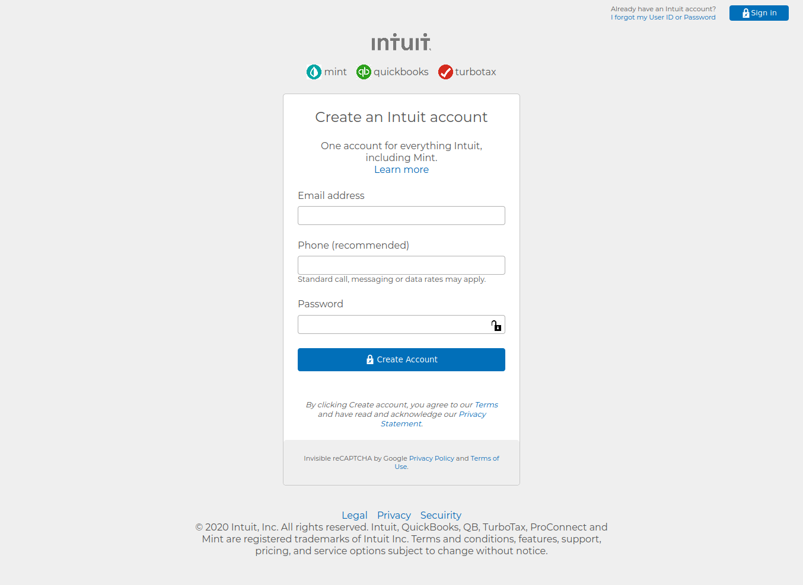

# Mint signup-page clone

> this is a clone of the Intuit mint sign-up page. The goal was to make it look as similar as possible.



## Built With

- HTML5
- CSS3

## Authors

👤 **Author1**

- Github: [@githubhandle](https://github.com/thedekerone)
- Twitter: [@twitterhandle](https://twitter.com/mauricio_fow)
- Linkedin: [linkedin](https://www.linkedin.com/in/mauricio-fow-aranibar-b2173514b/)

👤 **Author2**

- Github: [@githubhandle](https://github.com/misterpaul4)
- Twitter: [@twitterhandle](https://twitter.com/paulajuze)
- Linkedin: [linkedin](https://www.linkedin.com/in/chukwuebuka-paul-ajuizeogu/)

## Getting started

- Clone the repository with:
    ``` git clone git@github.com:misterpaul4/mint-signup-clone.git ```

- See the original page here: https://accounts.intuit.com/signup.html

- Check the index.html to edit the structure of the page.

- Check the style.css to edit the style of any component.

## 🤝 Contributing

Contributions, issues and feature requests are welcome!

Feel free to check the [issues page](issues/).

## Show your support

Give a ⭐️ if you like this project!

## Live preview

You can check how the website looks in: https://rawcdn.githack.com/misterpaul4/mint-signup-clone/fd40023771ef7bfe76c0428422bde12b39820b0e/index.html

## 📝 License

This project is [MIT](lic.url) licensed.
# mint-signup-clone